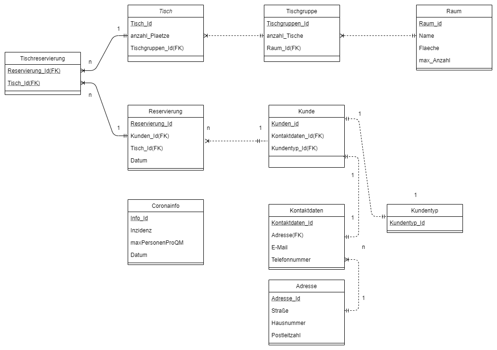
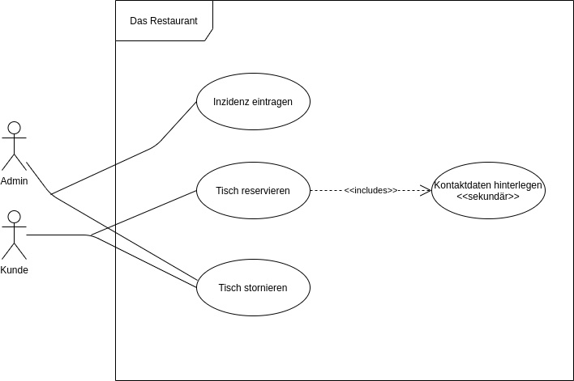

# ReservierungsMaster21

## Teamvorstellung

* Maik Löwen (Teamleiter)
* Marc Cremer
* Christoph Josef Müller
* Adrian Nierstenhöfer
* Edgar Kinetz

---

## Projektvorstellung

Seit Ausbruch der Corona Pandemie leidet insbesondere die Gastronomie an den von Bund und Ländern beschlossenen Auflagen. Bereits seit 6 Monaten ist den Kunden der Verzehr vor Ort untersagt. Lediglich die Lieferung und Abholung mitnahmefähiger Speisen für den Verzehr zu Hause bleiben weiterhin bestehen. Das Geschäftsmodell vieler Gastronomen ist jedoch nicht auf den To-Go Betrieb ausgelegt. Diese sind darauf angewiesen, ihre Kunden vor Ort zu bedienen. Im Zuge dessen sehen sich viele ihrer Existenz bedroht, sollten nicht in absehbarer Zeit Öffnungsperspektiven vorliegen.

Mit unserer Applikation möchten wir einen Beitrag zur schrittweisen Wiedereröffnung der Gastronomie leisten. Wir verfolgen das Ziel, den Gastronomen eine digitale Anwendung zur Verfügung zu stellen, welche ihnen helfen soll, abhängig vom Inzidenzwert, auf getroffenen Maßnahmen und Regeln angemessen zu reagieren und Corona konform umzusetzen. De Facto sollen somit grundsätzliche Schließungen vermieden werden. Die Kunden können Reservierungen, Umbuchungen und Stornierungen vornehmen. Die Anwendung informiert über aktuelle Verordnungen und die entsprechenden Auswirkungen auf die Reservierung. Sollte der Inzidenzwert beispielsweise über 100 liegen, können Kunden nur einen Tisch im Außenbereich reservieren. Zudem werden die Kunden hinsichtlich der Kontaktnachverfolgung gebeten, ein Kontaktformular auszufüllen, um mögliche Infektionsketten schnell zu durchbrechen. Kunden die sich am selben Tag wie die infizierte Person im Restaurant aufgehalten haben, werden von unserer Applikation automatisch informiert und gebeten, sich in Quarantäne zu begeben und den Anweisungen des Robert Koch Instituts (RKI) Folge zu leisten. Diese Informationen können dann an die zuständigen Gesundheitsämter übermittelt werden. Zum gegenwärtigen Zeitpunkt ist dem Einzelhandel untersagt, Kunden zu empfangen, die keinen negativen Corona-Selbsttest (der nicht älter als 24 Stunden ist) oder Impfnachweis vorweisen können. Sollte diese Regelung analog für die Gastronomie übernommen werden, bietet unsere Applikation die Möglichkeit, den erforderlichen Nachweis als PDF hochzuladen. In diesem Zusammenhang wirken wir der Bürokratie entgegen, da Kunden ihre Kundendaten im Vorjahr teilweise auf Papier festhalten mussten und von den Mitarbeitern an das Gesundheitsamt übermittelt wurden.

Für die Realisierung unserer Idee benötigen wir einerseits die Kundendaten und zum anderen den aktuellen Inzidenzwert, der sich stätig ändert. Beides wird von uns gemockt, sprich die Daten werden von uns simuliert bzw. der Inzidenzwert per Zufall generiert, um eine gewisse Dynamik simulieren zu können. Künftig können wir uns auch vorstellen, die Daten zur Infektionslage von dem Robert Koch Institut (RKI) einzuholen, indem wir unsere Anwendung an eine API des RKI anbinden, um mit einer echten Datenbasis zu arbeiten. Dieses Feature sehen wir aber derzeit als “nice to have“ an und beschränken uns vorerst auf die von uns genierten Daten.

---

## ERM-Diagramm

---

## Use Case

### Benutzergruppen

#### __Kunde__

Der Kunde ist der Hauptnutzer der Applikation.
Er kann Reservierungen und Stornierungen vornehmen.
#### __Admin__

Der Admin ist der Administrator der Applikationen.
Er kann Stornierungen vornehmen und den Inzidenzwert eintragen.

---

## Funktionen und Prozeduren

In der Datenbank muss häufig die maximale Anzahl an Personen pro Raum abgefragt werden. Um dies zu erleichtern erstellen wir eine Funktion, welche als Rückgabewert die maximale Anzahl an Personen pro Raum zurückgibt. Eine weitere Funktion liefert die Anzahl an noch freien Plätzen im lokal wieder.

Da die Hauptaufgabe, und somit eine, sich oft wiederholende Prozedur, ist die Erstellung einer neuen Reservierung. Des Weiteren soll man zu den Reservierungen Personen hinzufügen können, welches eine weitere Prozedur darstellt, die sich klar von der Reservierungs-Prozedur abgrenzt. Die dritte Prozedur ist, dass man Umbuchungen vornehmen kann.

---

## Trigger

Damit keine Redundanten Daten in der Datenbank existieren soll bei einem Insert ein Trigger überprüfen, ob der Kunde schon an dem bestimmten Tag gebucht hat. Zudem soll ein weiterer Insert Trigger eine Fehlermeldung zurückgeben, wenn man eine Person zu einer nicht vorhandenen Buchung hinzufügen möchte. Ein weiterer Insert oder Update Trigger storniert Reservierungen, wenn eine bestimmte Inzidenzzahl überschritten wurde. Der zweite Update und Insert Trigger Reduziert die Plätze für einen Raum, wenn eine bestimmte Inzidenzzahl überschritten wurde. Wenn ein weiterer Tisch hinzugefügt wird, sorgt ein Insert Trigger dafür, dass der Datensatz maxAnzahlPersonen aktualisiert wird.

---

## Views

Eine sinnvolle View für die Datenbank ist eine Übersicht über die Kunden, welche aktuell im Restaurant sind. Eine weitere View ist es, eine Übersicht über die Buchungen von einem bestimmten Tag zu generieren.

---
